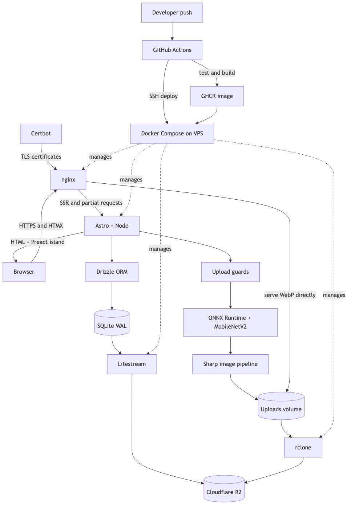
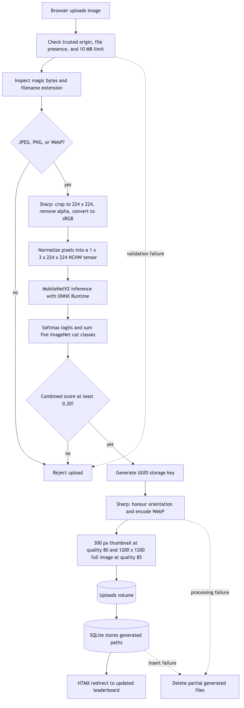
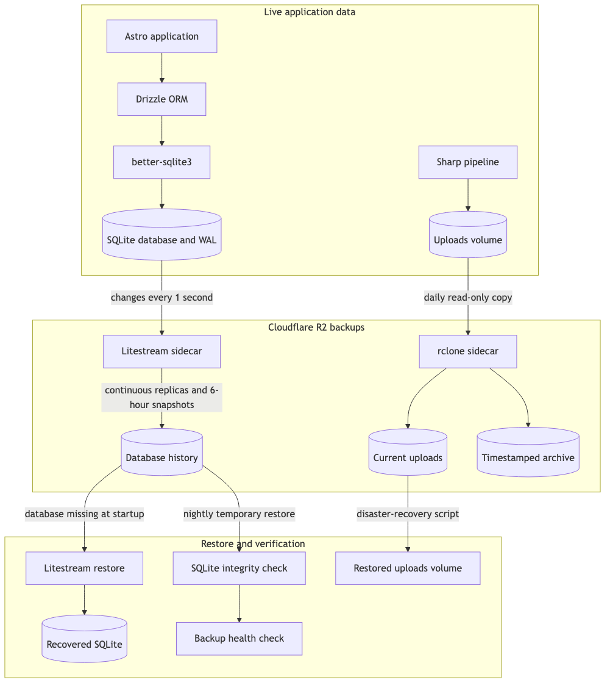

# Cat Ranking

Cat Ranking is a self-hosted, production-oriented website where visitors submit cat photos, vote for their favourites, and discuss each entry. The leaderboard is intentionally simple—cats are ranked by likes—but the system behind it demonstrates a complete modern web stack: server-rendered pages, progressively enhanced interactions, local machine-learning inference, secure image handling, transactional persistence, automated delivery, and tested disaster recovery.

The project is designed as a technical exercise and is my first attempt at self-hosting a full stack application. I have tried to favour purposeful, explainable choices over unnecessary complexity: minimal browser [JavaScript](https://developer.mozilla.org/en-US/docs/Web/JavaScript), a single-host [SQLite](https://sqlite.org/docs.html) architecture, reproducible containers, and inexpensive object-storage backups.

## How it works

1. [Astro](https://docs.astro.build/) renders the initial leaderboard, cat grid, and server-side HTML fragments.
2. [HTMX](https://htmx.org/docs/) requests those fragments for pagination, modals, likes, comments, and uploads without a client-side SPA.
3. A small [Preact](https://preactjs.com/guide/v10/getting-started/) island adds immediate file-preview behaviour where client state is useful.
4. Uploads pass size, extension, and magic-byte checks before a local [MobileNetV2](https://docs.pytorch.org/vision/main/models/generated/torchvision.models.mobilenet_v2.html) [ONNX](https://onnx.ai/onnx/intro/) model verifies that the image contains a cat.
5. [Sharp](https://sharp.pixelplumbing.com/) rotates, resizes, strips metadata, and creates thumbnail and full-size WebP files; only processed files are retained.
6. [Drizzle ORM](https://orm.drizzle.team/docs/overview) writes cat metadata, votes, and comments to [SQLite](https://sqlite.org/docs.html). Unique constraints and transactions enforce one like and one comment per visitor per cat.
7. [nginx](https://nginx.org/en/docs/) serves generated images directly, proxies application requests, terminates TLS, applies security headers, and rate-limits sensitive routes.



## Image processing and cat classification

The upload pipeline aims to keep the leaderboard focused on cat photos while treating every submitted file as untrusted input. The classifier is a content gate, not a breed detector or identity system: a pretrained [MobileNetV2](https://docs.pytorch.org/vision/main/models/generated/torchvision.models.mobilenet_v2.html) model estimates the probability that an image belongs to one of ImageNet's five cat classes. [ONNX Runtime](https://onnxruntime.ai/docs/) runs that model entirely on the application host, so photos are not sent to a third-party inference service. The five probabilities are added together and the upload is accepted when their combined score reaches the configurable `0.20` threshold. Inference is limited to two concurrent jobs to control CPU and memory pressure on a small VPS.

Before inference, the route rejects files larger than 10 MB and validates both their filename extension and their actual bytes. The MIME detector reads format signatures—JPEG's start marker, PNG's signature, or the combined RIFF and WEBP markers—instead of trusting the browser-provided `Content-Type`. Only JPEG, PNG, and WebP raster images continue, which rejects renamed files, generic RIFF containers, SVG payloads, and arbitrary data before they reach the model.

[Sharp](https://sharp.pixelplumbing.com/) has two separate responsibilities in the flow:

1. **Model preprocessing:** Sharp crops the validated image to `224 × 224`, removes alpha, converts it to sRGB, and exposes raw pixels. The application scales and normalizes those values with the ImageNet mean and standard deviation, then arranges them as the `1 × 3 × 224 × 224` tensor expected by MobileNetV2.
2. **Safe delivery assets:** after classification succeeds, Sharp honours EXIF orientation and creates a 300 px thumbnail at WebP quality 80 plus a full image bounded to `1200 × 1200` at quality 85. Resizing never enlarges smaller inputs, conversion strips the original metadata, generated UUID names prevent user-controlled paths, and the unprocessed upload is never retained.

The generated files are written before their paths are inserted into SQLite. If either Sharp output fails, partial files are removed; if the database insert fails, both completed variants are deleted. This keeps the uploads volume and database consistent while allowing [nginx](https://nginx.org/en/docs/) to serve the optimized WebP assets directly.



## Database, replication, and backups

The data layer keeps the operational simplicity of a single-file database without giving up typed access or recovery controls. [Drizzle ORM](https://orm.drizzle.team/docs/overview) defines the schema and provides type-safe queries, while [better-sqlite3](https://github.com/WiseLibs/better-sqlite3/blob/master/docs/api.md) supplies synchronous transactions over [SQLite](https://sqlite.org/docs.html). The schema separates the domain into cats, votes, and comments: cat rows hold processed image paths and a leaderboard-friendly like counter, while foreign keys connect votes and comments to their cat. Indexes support leaderboard and chronological reads, and database-level unique constraints enforce one vote or comment per visitor and cat even under concurrent requests.

At connection time, SQLite enables [write-ahead logging (WAL)](https://sqlite.org/wal.html), foreign-key enforcement, and a five-second busy timeout. A vote insert and its denormalized counter update run in one transaction, so the leaderboard cannot diverge from accepted votes. The database lives in the host-mounted `data/` directory and therefore survives application-container replacement; generated WebP files live in a separate Docker volume because the database stores paths rather than image bytes.

Production protects these two stores independently:

- [Litestream](https://litestream.io/) continuously streams database WAL changes to [Cloudflare R2](https://developers.cloudflare.com/r2/) every second, creates snapshots every six hours, and retains seven days of recovery history. If the local database is missing, the application entrypoint attempts a restore before Astro starts.
- [rclone](https://rclone.org/docs/) copies the uploads volume to R2 once per day from a read-only mount. The process is additive and moves replaced remote objects into timestamped archive paths, preventing a local wipe from being propagated as a destructive deletion.
- A nightly job restores the database into a temporary directory, runs SQLite's `PRAGMA integrity_check`, and confirms that the cats table is readable. Separate health-check pings make missed image backups and failed database restore drills observable.
- Disaster recovery restores the database through Litestream and images through the dedicated [`deploy/restore-images.sh`](deploy/restore-images.sh) script. The deployment runbook requires both paths to be tested against temporary storage before they are trusted in production.



Operational setup and restore-drill commands are documented in [`deploy/FIRST_DEPLOY.md`](deploy/FIRST_DEPLOY.md).

## Technology choices

| Technology                                                                                                                                                                                                                 | Role and reason for choosing it                                                                                                                                                                                                                                                                                                                                                                       |
| -------------------------------------------------------------------------------------------------------------------------------------------------------------------------------------------------------------------------- | ----------------------------------------------------------------------------------------------------------------------------------------------------------------------------------------------------------------------------------------------------------------------------------------------------------------------------------------------------------------------------------------------------- |
| [**Astro 5 SSR**](https://docs.astro.build/en/guides/on-demand-rendering/)                                                                                                                                                 | Produces fast server-rendered pages and reusable HTML partial endpoints while avoiding a large client bundle.                                                                                                                                                                                                                                                                                         |
| [**Node.js 22**](https://nodejs.org/docs/latest-v22.x/api/)                                                                                                                                                                | Runs [Astro](https://docs.astro.build/) in standalone server mode and provides a current, consistent runtime across local development, CI, and production.                                                                                                                                                                                                                                            |
| [**TypeScript**](https://www.typescriptlang.org/docs/) + [**ESM**](https://nodejs.org/api/esm.html)                                                                                                                        | Makes route, component, database, and utility contracts explicit and catches integration errors early.                                                                                                                                                                                                                                                                                                |
| [**HTMX 2**](https://htmx.org/docs/)                                                                                                                                                                                       | Adds pagination, modal loading, voting, commenting, and form submission through HTML-over-the-wire instead of SPA complexity. It is pinned, self-hosted, and protected with SRI.                                                                                                                                                                                                                      |
| [**Preact**](https://preactjs.com/guide/v10/getting-started/)                                                                                                                                                              | Hydrates only the upload form that benefits from client-side state and preview behaviour, demonstrating an islands architecture.                                                                                                                                                                                                                                                                      |
| [**SQLite**](https://sqlite.org/docs.html)                                                                                                                                                                                 | Delivers durable ACID transactions with very low operational overhead for a single-node application. WAL mode supports the live workload and continuous replication.                                                                                                                                                                                                                                  |
| [**better-sqlite3**](https://github.com/WiseLibs/better-sqlite3/blob/master/docs/api.md)                                                                                                                                   | Provides a fast, dependable native SQLite driver with straightforward transaction semantics.                                                                                                                                                                                                                                                                                                          |
| [**Drizzle ORM**](https://orm.drizzle.team/docs/overview)                                                                                                                                                                  | Supplies typed schemas, queries, and migrations without hiding SQL or adding a heavyweight data layer.                                                                                                                                                                                                                                                                                                |
| [**Sharp**](https://sharp.pixelplumbing.com/)                                                                                                                                                                              | Safely normalizes uploaded images into efficient WebP variants, caps dimensions, honours EXIF rotation, and discards originals.                                                                                                                                                                                                                                                                       |
| [**ONNX Runtime**](https://onnxruntime.ai/docs/) + [**MobileNetV2**](https://docs.pytorch.org/vision/main/models/generated/torchvision.models.mobilenet_v2.html)                                                           | Performs cat detection locally, avoiding third-party inference APIs, per-request fees, and external data sharing. Inference concurrency is bounded to protect the host.                                                                                                                                                                                                                               |
| [**nginx**](https://nginx.org/en/docs/)                                                                                                                                                                                    | Acts as the hardened edge: TLS termination, reverse proxying, rate limiting, compression, security headers, and direct static image delivery.                                                                                                                                                                                                                                                         |
| [**Docker**](https://docs.docker.com/engine/) + [**Docker Compose**](https://docs.docker.com/compose/)                                                                                                                     | Reproduces the complete runtime—including native dependencies and sidecars—without host drift. Multi-stage [Debian](https://www.debian.org/doc/) images retain [glibc](https://sourceware.org/glibc/manual/latest/html_mono/libc.html) compatibility for [ONNX Runtime](https://onnxruntime.ai/docs/), [Sharp](https://sharp.pixelplumbing.com/), and [SQLite](https://sqlite.org/docs.html) modules. |
| [**Litestream**](https://litestream.io/reference/)                                                                                                                                                                         | Continuously replicates the SQLite WAL to object storage and restores a missing database before application startup.                                                                                                                                                                                                                                                                                  |
| [**rclone**](https://rclone.org/docs/) + [**Cloudflare R2**](https://developers.cloudflare.com/r2/)                                                                                                                        | Backs up generated images independently from the database using low-cost, S3-compatible object storage.                                                                                                                                                                                                                                                                                               |
| [**Certbot**](https://eff-certbot.readthedocs.io/en/stable/)                                                                                                                                                               | Issues and renews [Let's Encrypt](https://letsencrypt.org/docs/) certificates without manual certificate management.                                                                                                                                                                                                                                                                                  |
| [**GitHub Actions**](https://docs.github.com/en/actions) + [**GHCR**](https://docs.github.com/en/packages/working-with-a-github-packages-registry/working-with-the-container-registry)                                     | Gates releases on linting, type checks, and tests; verifies the model checksum; builds the image; and deploys immutable Git-SHA tags with a health gate and simple rollback.                                                                                                                                                                                                                          |
| [**Vitest**](https://vitest.dev/guide/), [**Astro Check**](https://docs.astro.build/en/reference/cli-reference/#astro-check), [**ESLint**](https://eslint.org/docs/latest/), and [**Prettier**](https://prettier.io/docs/) | Provide automated behavioural tests, framework-aware type checking, static analysis, and consistent formatting.                                                                                                                                                                                                                                                                                       |

Security is layered throughout the stack: signed `HttpOnly` visitor cookies, origin checks, trusted proxy IP handling, route-specific rate limits, magic-byte file validation, generated storage keys, database uniqueness constraints, CSP/HSTS headers, and a hardened VPS configuration.

## Run locally

### Prerequisites

- [Node.js **22**](https://nodejs.org/docs/latest-v22.x/api/) and [npm](https://docs.npmjs.com/)
- [`curl`](https://curl.se/docs/) and [`sha256sum`](https://www.gnu.org/software/coreutils/manual/html_node/sha2-utilities.html) for the verified model download
- A [MobileNetV2](https://docs.pytorch.org/vision/main/models/generated/torchvision.models.mobilenet_v2.html) [ONNX](https://onnx.ai/onnx/intro/) download URL and its SHA-256 checksum
- At least one cat photo in JPEG, PNG, or WebP format (maximum 10 MB)

### Setup

```bash
git clone https://github.com/vdassios/KOT.git
cd KOT
npm ci

MODEL_URL="https://example.com/mobilenetv2-cat.onnx" \
MODEL_SHA256="expected-sha256" \
npm run local:model
```

Add fixture photos to `test-cats/`, then build the local dataset and start [Astro](https://docs.astro.build/):

```bash
npm run local:refresh
npm run dev:local
```

Open <http://localhost:4321>. The refresh command runs every fixture through the production validation, [ONNX Runtime](https://onnxruntime.ai/docs/), [Sharp](https://sharp.pixelplumbing.com/), migration, and [SQLite](https://sqlite.org/docs.html) pipeline before replacing local data. If any file fails validation, the existing dataset remains unchanged.

`dev:local` deliberately enables the insecure local-only identity and CSRF bypass, so no production secrets are required. Never set `LOCAL_DEV=1` in a deployed environment.

### Quality checks

```bash
npm test
npm run typecheck
npm run format:check
npm run lint
npm run lint:format-compat
```

## Deploy

Production targets an [Ubuntu 24.04](https://documentation.ubuntu.com/server/) VPS with [Docker Compose](https://docs.docker.com/compose/), a domain name, [Cloudflare R2](https://developers.cloudflare.com/r2/) credentials, and [GitHub Actions](https://docs.github.com/en/actions) access. The authoritative copy-paste first-deployment runbook is [`deploy/FIRST_DEPLOY.md`](deploy/FIRST_DEPLOY.md); the high-level sequence is:

1. Point an IPv4 **A** record at the VPS. Do not add an AAAA record unless the [Docker](https://docs.docker.com/engine/network/) networking setup is updated for IPv6.
2. Replace the `yourdomain.com` placeholders in `deploy/nginx.conf` with the deployment domain.
3. Run `deploy/provision.sh` as root with the deploy user's public key and repository URL. It idempotently installs [Docker](https://docs.docker.com/engine/), configures the firewall and SSH hardening, creates the deploy user, clones into `/opt/cat-ranking`, and installs backup verification.
4. Copy `.env.example` to `/opt/cat-ranking/.env`, restrict it to mode `0600`, and set `ALLOWED_ORIGIN`, a generated `HMAC_SECRET`, [Cloudflare R2](https://developers.cloudflare.com/r2/) credentials, and monitoring URLs.
5. Configure [GHCR](https://docs.github.com/en/packages/working-with-a-github-packages-registry/working-with-the-container-registry)/repository access if either is private, then issue the first TLS certificate with the standalone [Certbot](https://eff-certbot.readthedocs.io/en/stable/) command in the runbook **before** starting [nginx](https://nginx.org/en/docs/).
6. Start the stack, apply migrations, and verify the writable health endpoint:

   ```bash
   cd /opt/cat-ranking
   docker compose up -d
   docker compose run --rm --no-deps app node dist/scripts/migrate.mjs
   curl -fsS https://yourdomain.com/health
   # {"status":"ok"}
   ```

7. Register uptime and backup health checks, then complete the database and image restore drills in the runbook.

### Automated releases

Add these [GitHub Actions](https://docs.github.com/en/actions) repository secrets:

- `MODEL_URL` and `MODEL_SHA256`
- `DEPLOY_HOST`, `DEPLOY_USER`, and `DEPLOY_SSH_KEY`

Every push to `main` runs install, lint, type checking, and tests; downloads and verifies the private model artifact; builds the production image; and publishes both Git-SHA and `latest` tags to [GHCR](https://docs.github.com/en/packages/working-with-a-github-packages-registry/working-with-the-container-registry). The deploy job connects to `/opt/cat-ranking`, pins `IMAGE_TAG` to the commit SHA, pulls the image, migrates before replacing the running application, starts the [Docker Compose](https://docs.docker.com/compose/) stack, and requires `/health` to pass.

To roll back, set `IMAGE_TAG` in the VPS `.env` to a known-good commit SHA and run:

```bash
docker compose up -d app
```

Database changes must remain backward-compatible during a deployment because migrations run while the previous application container is still serving traffic.
